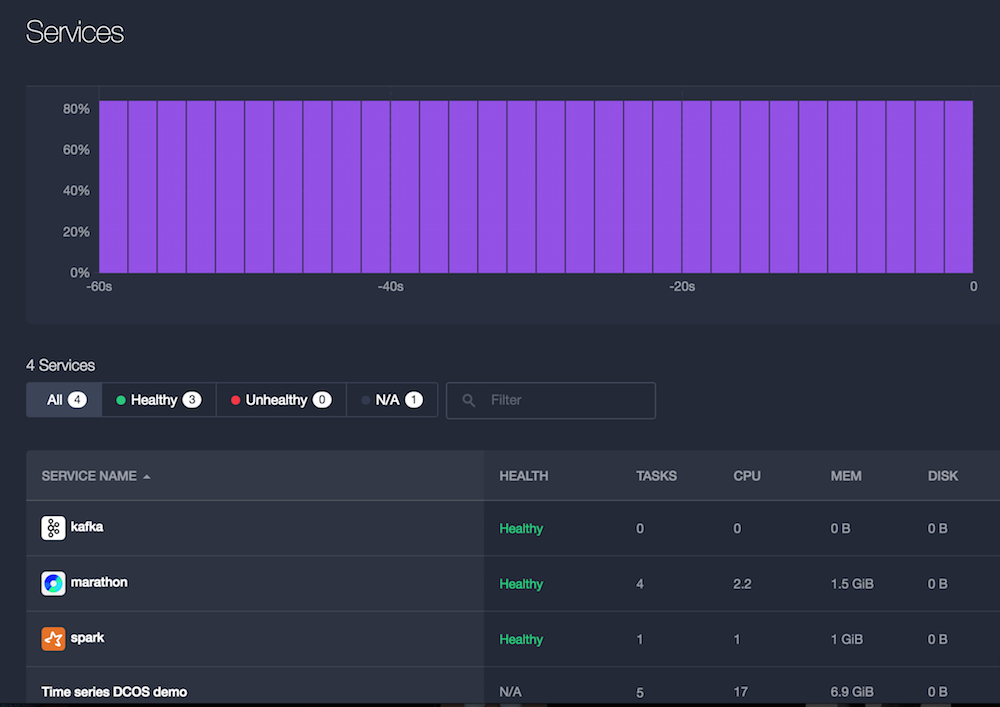

# Time Series DCOS Demo: Crime Buster!

## Overview

In this demo we take the [crime](https://data.cityofchicago.org/Public-Safety/Crimes-2001-to-present/ijzp-q8t2) dataset from the City of Chicago, turn it into a streaming data source and process the data in two paths:

- an [online](online/) path, using a time series database (InfluxDB) and visualize the crime types in Grafana.
- an [offline](offline/) part, using Spark jobs to create an overlay heat map of aggregated crimes on Google Maps.

## Architecture

### Dependencies

- Mesosphere [DCOS 1.3](https://mesosphere.com/product/) {ALL}
 - [Marathon 0.11.1](https://mesosphere.github.io/marathon/) {ALL}
 - [InfluxDB 0.9.4](https://influxdb.com/) {ONLINE}
 - [Grafana 2.1.3](http://grafana.org/) {ONLINE}
 - [Spark 1.5](https://spark.apache.org/) {ALL}
- [heatmap.js 2.0](http://www.patrick-wied.at/static/heatmapjs/) {OFFLINE}
- AWS S3 and the [CLI](http://aws.amazon.com/documentation/cli/) {OFFLINE}
- [Docker Hub](https://hub.docker.com/r/mhausenblas/tsdemo-offline-reporting-ui/) {OFFLINE}

### Deployment

To do:

- Add documentation (asciinema) for overall setup (Michael H9)
- Create video walkthrough (Michael H9)
- Add to [DCOS Demo](http://demo.datacenter-os.info/) (Michael H9)
- Add real timestamps to influxDB data
