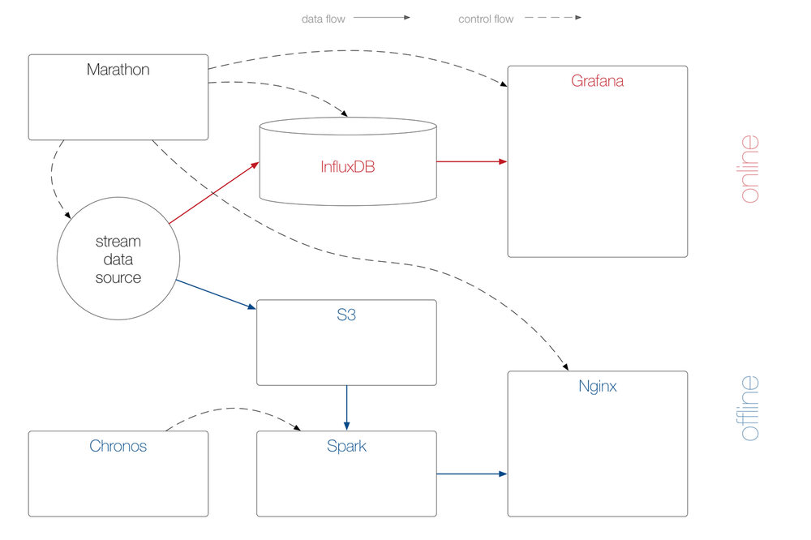

# Time Series Demo: Crime Buster!

- Implement synth stream source + Kafka publisher (Tobi)
- Implement Spark-Kafka consumer: ingest into InfluxDB and aggregation + S3 (Michael G)
- Implement offline reporting front-end: consume JSON from Spark job and overlay heatmap (Michael H9)
- Add documentation (asciinema) + video walkthrough (Michael H9)
- Add to [DCOS Demo](http://demo.datacenter-os.info/) (Michael H9)

## Overview

In this demo we takes the input of a stream data source and process data it in two paths: an [online](online/) path using a time series database and an [offline](offline/) part using micro-batch jobs to create geocoded reports.

We use the  [crime](https://data.cityofchicago.org/Public-Safety/Crimes-2001-to-present/ijzp-q8t2) dataset from the City of Chicago.

## Architecture

### Tooling

- Mesosphere DCOS 1.3
- Marathon 0.11.1
- InfluxDB 0.9.4
- Grafana 2.1.3
- Spark 1.5
- [heatmap.js 2.0](http://www.patrick-wied.at/static/heatmapjs/)

### Deployment

