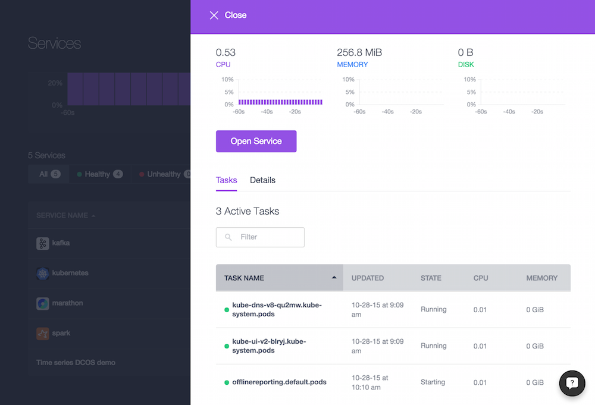
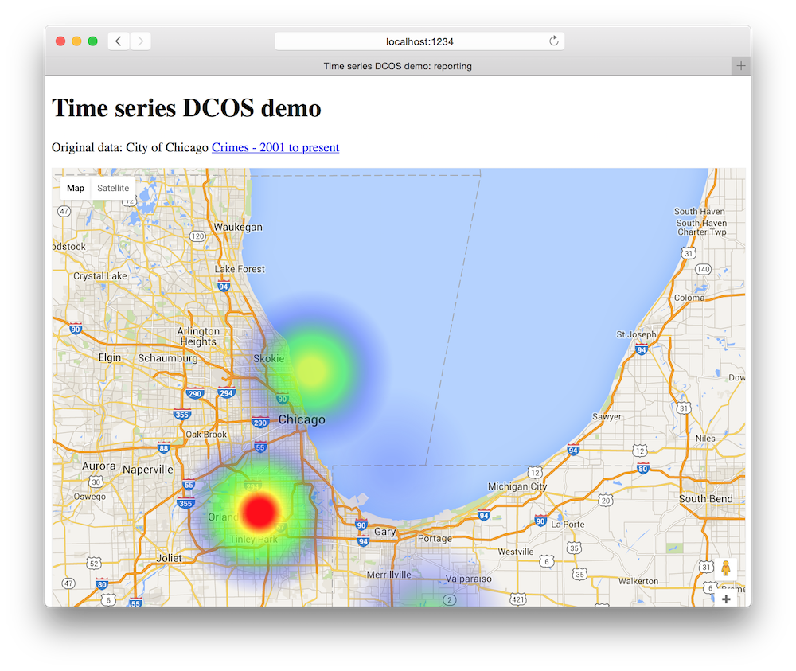

# Offline part

We have two Docker containers running in the [pod](k8s-offlinereporting.yaml):

- The [Web UI](https://hub.docker.com/r/mhausenblas/tsdemo-offline-reporting-ui/) 
- The [S3 fetcher](https://hub.docker.com/r/mhausenblas/tsdemo-s3-fetcher/)

The offline reporting Web UI and the S3 fetcher have a shared data volume at `/tmp/tsdemo`.

## Install Kubernetes

The offline part is deployed via [Kubernetes](https://docs.mesosphere.com/services/kubernetes/), so let's install that:

    $ dcos config prepend package.sources https://github.com/mesosphere/multiverse/archive/version-1.x.zip
    $ dcos package update --validate
    $ dcos package install kubernetes

Now we need to configure Kubernetes:

    $ export KUBERNETES_MASTER=http://$MESOS_MASTER_IP/service/kubernetes/api

Next, [install](https://docs.mesosphere.com/services/kubernetes/#a-namefivealaunch-a-kubernetes-pod-and-service-by-using-kubectl) `kubectl`
and check if everything is fine:

    $  kubectl cluster-info
    Kubernetes master is running at http://54.186.126.114
    KubeDNS is running at http://54.186.126.114/api/v1/proxy/namespaces/kube-system/services/kube-dns
    KubeUI is running at http://54.186.126.114/api/v1/proxy/namespaces/kube-system/services/kube-ui

## Install offline reporting Web UI

In order to work properly you'll need to supply the S3 fetcher with your AWS credentials, so create a file called `aws-secret.yaml` with this content:

    apiVersion: v1
    kind: Secret
    metadata:
      name: awssecret
    type: Opaque
    data:
      AWS-ACCESS-KEY-ID: $YOUR_AWS_KEY
      AWS-SECRET-ACCESS-KEY: $YOUR_AWS_SECRET

Make sure you replace `$YOUR_AWS_KEY` and `$YOUR_AWS_SECRET` with the `base64` encoded values you glean from the AWS IAM, see also this [docs](http://docs.aws.amazon.com/general/latest/gr/aws-access-keys-best-practices.html). For example: `echo -n 123456789 | base64`.

Finally we can launch our offline reporting [replication controller](http://kubernetes.io/v1.0/docs/user-guide/walkthrough/k8s201.html#replication-controllers):

    $ kubectl create -f aws-secret.yaml
    $ kubectl create -f k8s-offlinereporting-rc.yaml
    $ kubectl get rc
    CONTROLLER            CONTAINER(S)   IMAGE(S)                                  SELECTOR                REPLICAS
    offlinereporting-rc   s3-fetcher     mhausenblas/tsdemo-s3-fetcher             name=offlinereporting   1
                          webui          mhausenblas/tsdemo-offline-reporting-ui
    $ kubectl create -f k8s-offlinereporting-service.yaml
    $ kubectl get services
    NAME                       LABELS                                    SELECTOR                IP(S)          PORT(S)
    k8sm-scheduler             component=scheduler,provider=k8sm         <none>                  10.10.10.9     10251/TCP
    kubernetes                 component=apiserver,provider=kubernetes   <none>                  10.10.10.1     443/TCP
    offlinereporting-service   <none>                                    name=offlinereporting   10.10.10.251   80/TCP
    $ kubectl get endpoints
    NAME                       ENDPOINTS
    k8sm-scheduler             10.0.3.201:25504
    kubernetes                 10.0.3.201:25502
    offlinereporting-service   10.0.3.200:1028

In order to access the Web UI all you have to do is visit the following URL (with `$DCOS_DASHBOARD_FQHN` being your DCOS cluster dashboard URL):

    http://$DCOS_DASHBOARD_FQHN/service/kubernetes/api/v1/proxy/namespaces/default/services/offlinereporting-service/

Once you're done, you can remove the RC and service with `kubectl delete rc offlinereporting-rc && kubectl delete service offlinereporting-service`.

## Customize offline reporting

If you want to change the offline reporting Web UI you'll have to build your own Docker image. 
My images are hosted on Docker hub and are automated builds. This means that whenever the 
content in `s3-fetcher/` or in `webui/` changes, the respective Docker images are built.
Note that the Kubernetes Replication Controller (`k8s-offlinereporting-rc.yaml`) is set up in a way that new images are automatically
pulled (via `imagePullPolicy: Always`).

### Build offline reporting Web UI

The offline reporting Web UI is an automated Docker hub build, see: https://hub.docker.com/r/mhausenblas/tsdemo-offline-reporting-ui/

### Build S3 fetcher

The S3 data fetcher is an automated Docker hub build, see: https://hub.docker.com/r/mhausenblas/tsdemo-s3-fetcher/

Manually, the S3 fetcher does the following:

    $ docker run -it alpine:3.2 /bin/sh
    $ curl "https://s3.amazonaws.com/aws-cli/awscli-bundle.zip" -o "awscli-bundle.zip"
    $ unzip awscli-bundle.zip
    $ ./awscli-bundle/install -i /usr/local/aws -b /usr/local/bin/aws
    $ export AWS_ACCESS_KEY_ID=<access_key>
    $ export AWS_SECRET_ACCESS_KEY=<secret_key>
    $ aws s3 cp s3://mesosphere-tsdemo/offline-crime-data.json offline-crime-data.json

