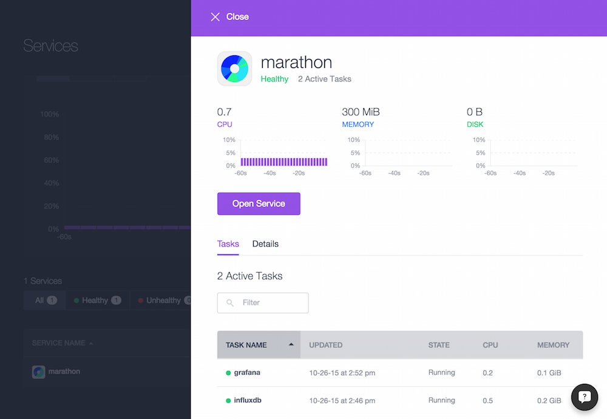
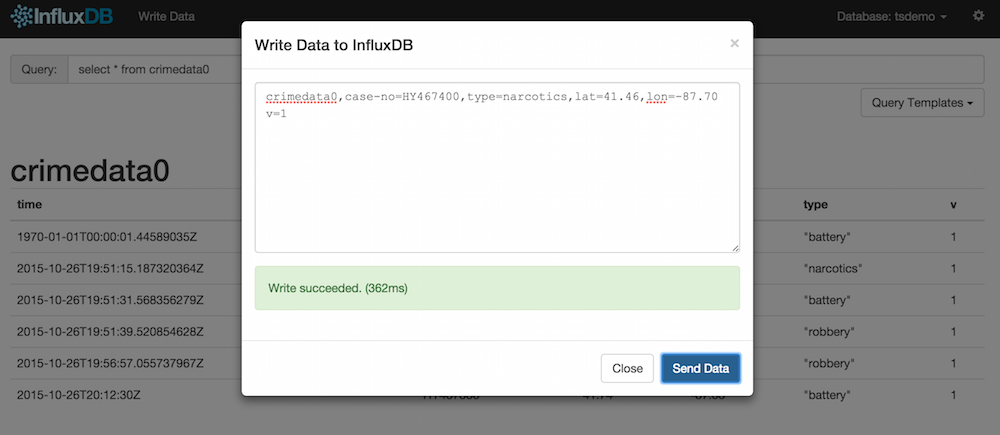
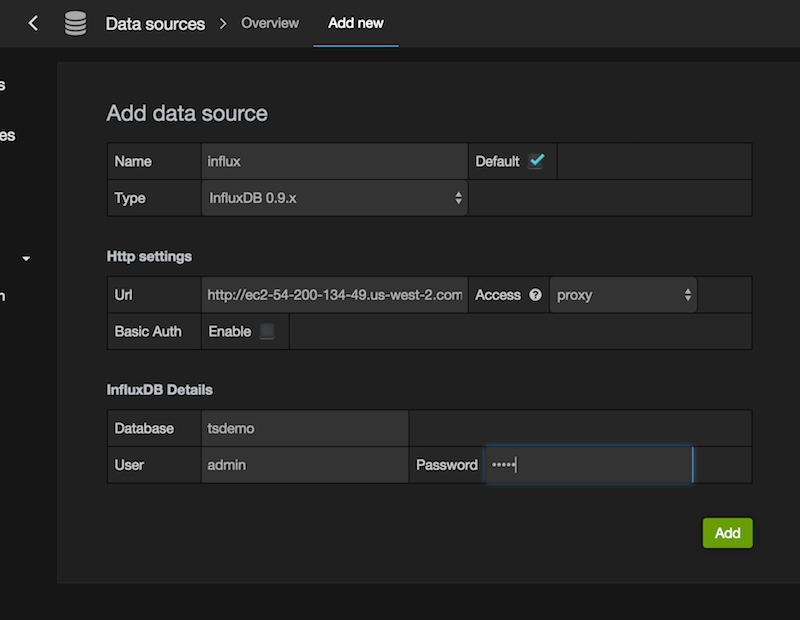
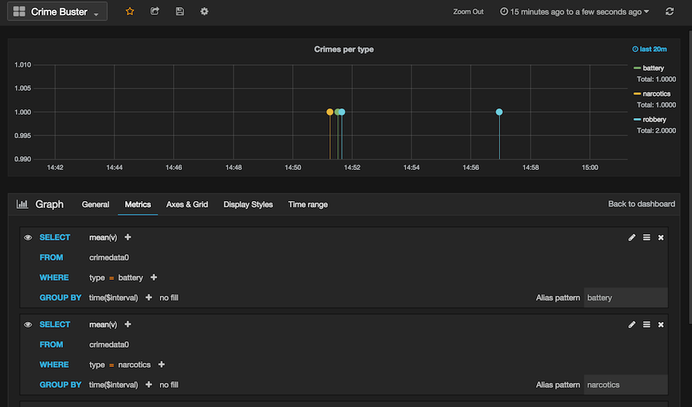

# Online part

In this part we will deploy three apps in Marathon: InfluxDB, Grafana, and Spark:

## InfluxDB

### Install InfluxDB

Deploy [InfluxDB](https://influxdb.com/docs/v0.9/introduction/overview.html) in Marathon:

    $ dcos marathon app add marathon-influxdb.json

OK, now, where does InfluxDB run? How can I access the Web UI and HTTP API?

    $ dcos marathon task list
    APP        HEALTHY          STARTED                             HOST                    ID
    /grafana     True   2015-10-26T19:52:37.733Z  ip-10-0-6-140.us-west-2.compute.internal  grafana.0d96dc8f-7c1b-11e5-863e-06ff3f135d7f
    /influxdb    True   2015-10-26T19:46:54.532Z  ip-10-0-6-140.us-west-2.compute.internal  influxdb.40a1fd4e-7c1a-11e5-863e-06ff3f135d7f
    
    $ dcos marathon task show influxdb.40a1fd4e-7c1a-11e5-863e-06ff3f135d7f
    {
      "appId": "/influxdb",
      "host": "ip-10-0-6-140.us-west-2.compute.internal",
      "id": "influxdb.40a1fd4e-7c1a-11e5-863e-06ff3f135d7f",
      "ports": [
        22371,
        22372
      ],
      "servicePorts": [
        10000,
        10001
      ],
      "slaveId": "20151026-171728-1510342666-5050-1260-S3",
      "stagedAt": "2015-10-26T19:46:30.032Z",
      "startedAt": "2015-10-26T19:46:54.532Z",
      "version": "2015-10-26T19:46:29.245Z"
    }

Note this address (`ip-10-0-6-140.us-west-2.compute.internal`) and the first port (`22371`), which is InfluxDB's Web UI (which per default runs on `8083`), and look it up in the AWS/EC2 console. In my case the public DNS was `ec2-54-200-134-49.us-west-2.compute.amazonaws.com` so we point our browser there.

### Configure InfluxDB and ingest data

Next step is to set up InfluxDB itself. You change the port from `8086` to the second port you gleaned above (in my case: `22372`); this is where InfluxDB's API is. Then, log in with `admin`, `admin` and create a database called `tsdemo` as so:

    CREATE DATABASE tsdemo
    ALTER RETENTION POLICY default ON tsdemo DURATION 1d

Now use the `Write Data` link (in the WebUI) to create some data:

For example, enter the following values:

        crimedata0,case-no=HY467388,type=battery,lat=41.74,lon=-87.55 v=1
        crimedata0,case-no=HY467389,type=robbery,lat=41.99,lon=-87.59 v=1
        crimedata0,case-no=HY467390,type=narcotics,lat=41.81,lon=-87.67 v=1
        crimedata0,case-no=HY467391,type=robbery,lat=41.86,lon=-87.40 v=1

Of course, if you prefer a CLI-based approach that's also possible:

        curl -i -XPOST 'http://$PUBLIC_SLAVE_FQHN:22372/write?db=tsdemo' --data-binary 'crimedata0,case-no=HY467397,type=narcotics,lat=41.89,lon=-87.51 v=1'

Here, you'll have to replace `$PUBLIC_SLAVE_FQHN:22372` with your values. 

Then you can query it like so:

        SELECT * FROM crimedata0

You're all set. Next we set up Grafana and connect it to InfluxDB.

## Grafana

### Install Grafana

Deploy Grafana in Marathon:

    $ dcos marathon app add marathon-grafana.json

How can I access Grafana?

    $ dcos marathon task list
    APP        HEALTHY          STARTED                             HOST                    ID
    /grafana     True   2015-10-26T19:52:37.733Z  ip-10-0-6-140.us-west-2.compute.internal  grafana.0d96dc8f-7c1b-11e5-863e-06ff3f135d7f
    /influxdb    True   2015-10-26T19:46:54.532Z  ip-10-0-6-140.us-west-2.compute.internal  influxdb.40a1fd4e-7c1a-11e5-863e-06ff3f135d7f
    
    $ dcos marathon task show grafana.0d96dc8f-7c1b-11e5-863e-06ff3f135d7f
    {
      "appId": "/grafana",
      "host": "ip-10-0-6-140.us-west-2.compute.internal",
      "id": "grafana.0d96dc8f-7c1b-11e5-863e-06ff3f135d7f",
      "ports": [
        625
      ],
      "servicePorts": [
        10002
      ],
      "slaveId": "20151026-171728-1510342666-5050-1260-S3",
      "stagedAt": "2015-10-26T19:52:13.862Z",
      "startedAt": "2015-10-26T19:52:37.733Z",
      "version": "2015-10-26T19:52:13.784Z"
    }

And again, following the same steps as above we discover that Grafana is running on `http://ec2-54-200-134-49.us-west-2.compute.amazonaws.com:625`. 
You log in with `admin`, `admin` again and you're ready to connect InfluxDB to it.

### Connect InfluxDB to Grafana

Next, we need to connect InfluxDB to Grafana:

Note: use the second InfluxDB port (in my case `22372`) to configure the datasource. See also the [Grafana-InfluxDB setup](http://docs.grafana.org/datasources/influxdb/).

Now you can define a dashboard and add a graph:

## Using Spark to ingest data into InfluxDB

For the online ingestion path (Kakfa->Spark->InfluxDB) we will need to explicitly set timestamps. The `date` column of the dataset contains the date which needs to be converted into an epoch timestamp and can then be inserted like so:

    curl -i -XPOST 'http://$PUBLIC_SLAVE_FQHN:22372/write?db=tsdemo' --data-binary 'crimedata0,case-no=HY467388,type=battery,lat=41.74,lon=-87.55 v=1 1445890350000000000'

Note the additional `1445890350000000000` at the end, after `v=1`.