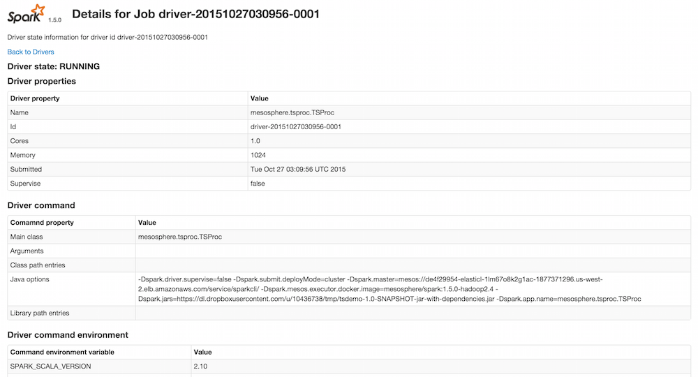

# Stream Processing

## Kafka

Install and set up:

     $ dcos package install kafka
     $ dcos kafka broker add 1
     broker added:
      id: 1
      active: false
      state: stopped
      resources: cpus:1.00, mem:2048, heap:1024, port:auto
      failover: delay:1m, max-delay:10m
      stickiness: period:10m

## Spark Data Ingestions

Install and set up:

    $ dcos package install spark

See the docs on [Kafka-Spark integration]http://spark.apache.org/docs/latest/streaming-kafka-integration.html and [this example](https://github.com/apache/spark/blob/master/examples/src/main/scala/org/apache/spark/examples/streaming/KafkaWordCount.scala).

Launch the Spark job manually like so:

    $ dcos spark run --submit-args='-Dspark.mesos.coarse=true --class mesosphere.tsproc.TSProc https://dl.dropboxusercontent.com/u/10436738/tmp/tsdemo-1.0-SNAPSHOT-jar-with-dependencies.jar'
    Run job succeeded. Submission id: driver-20151027031553-0002
    $ dcos spark status driver-20151027031553-0002
    Submission ID: driver-20151027031553-0002
    Driver state: RUNNING
    Last status: task_id {
      value: "driver-20151027031553-0002"
    }
    state: TASK_RUNNING
    data: "[\n{\n    \"Id\": \"ea1e600c917f4ba8aff62030c567609bf81bfdb154976709d45044c8d3ecf517\",\n    \"Created\": \"2015-10-27T03:15:57.707333166Z\",\n    \"Path\": \"/bin/sh\",\n    \"Args\": [\n        \"-c\",\n        \"./bin/spark-submit --name mesosphere.tsproc.TSProc --class mesosphere.tsproc.TSProc --master mesos://zk://master.mesos:2181/mesos --driver-cores 1.0 --driver-memory 1024M $MESOS_SANDBOX/tsdemo-1.0-SNAPSHOT-jar-with-dependencies.jar \"\n    ],\n    \"State\": {\n        \"Running\": true,\n        \"Paused\": false,\n        \"Restarting\": false,\n        \"OOMKilled\": false,\n        \"Dead\": false,\n        \"Pid\": 9469,\n        \"ExitCode\": 0,\n        \"Error\": \"\",\n        \"StartedAt\": \"2015-10-27T03:15:57.759314201Z\",\n        \"FinishedAt\": \"0001-01-01T00:00:00Z\"\n    },\n    \"Image\": \"cb8d076e6975d59eeccca0aa8ea18b08f1b5075f5d25bcf9bdeebd922764b951\",\n    \"NetworkSettings\": {\n        \"Bridge\": \"\",\n        \"EndpointID\": \"7f9b8402a99d5ef90101e9e711ab99db6f383589dba31bd4c28d64dd67cd8fcf\",\n        \"Gateway\": \"\\u003cnil\\u003e\",\n        \"GlobalIPv6Address\": \"\",\n        \"GlobalIPv6PrefixLen\": 0,\n        \"HairpinMode\": false,\n        \"IPAddress\": \"\",\n        \"IPPrefixLen\": 0,\n        \"IPv6Gateway\": \"\",\n        \"LinkLocalIPv6Address\": \"\",\n        \"LinkLocalIPv6PrefixLen\": 0,\n        \"MacAddress\": \"\",\n        \"NetworkID\": \"be80eca366cb821d53a3c1db72b336cdc6a7b49bd87f4245853e4b17462fcc9d\",\n        \"PortMapping\": null,\n        \"Ports\": {},\n        \"SandboxKey\": \"/var/run/docker/netns/default\",\n        \"SecondaryIPAddresses\": null,\n        \"SecondaryIPv6Addresses\": null\n    },\n    \"ResolvConfPath\": \"/var/lib/docker/containers/ea1e600c917f4ba8aff62030c567609bf81bfdb154976709d45044c8d3ecf517/resolv.conf\",\n    \"HostnamePath\": \"/var/lib/docker/containers/ea1e600c917f4ba8aff62030c567609bf81bfdb154976709d45044c8d3ecf517/hostname\",\n    \"HostsPath\": \"/var/lib/docker/containers/ea1e600c917f4ba8aff62030c567609bf81bfdb154976709d45044c8d3ecf517/hosts\",\n    \"LogPath\": \"/var/lib/docker/containers/ea1e600c917f4ba8aff62030c567609bf81bfdb154976709d45044c8d3ecf517/ea1e600c917f4ba8aff62030c567609bf81bfdb154976709d45044c8d3ecf517-json.log\",\n    \"Name\": \"/mesos-20151026-171728-1510342666-5050-1260-S5.df5be36b-ed40-4bfa-886d-71a37ea814d4\",\n    \"RestartCount\": 0,\n    \"Driver\": \"overlay\",\n    \"ExecDriver\": \"native-0.2\",\n    \"MountLabel\": \"\",\n    \"ProcessLabel\": \"\",\n    \"Volumes\": {\n        \"/mnt/mesos/sandbox\": \"/var/lib/mesos/slave/slaves/20151026-171728-1510342666-5050-1260-S5/frameworks/20151026-171728-1510342666-5050-1260-0001/executors/driver-20151027031553-0002/runs/df5be36b-ed40-4bfa-886d-71a37ea814d4\"\n    },\n    \"VolumesRW\": {\n        \"/mnt/mesos/sandbox\": true\n    },\n    \"AppArmorProfile\": \"\",\n    \"ExecIDs\": null,\n    \"HostConfig\": {\n        \"Binds\": [\n            \"/var/lib/mesos/slave/slaves/20151026-171728-1510342666-5050-1260-S5/frameworks/20151026-171728-1510342666-5050-1260-0001/executors/driver-20151027031553-0002/runs/df5be36b-ed40-4bfa-886d-71a37ea814d4:/mnt/mesos/sandbox\"\n        ],\n        \"ContainerIDFile\": \"\",\n        \"LxcConf\": [],\n        \"Memory\": 1073741824,\n        \"MemorySwap\": 0,\n        \"CpuShares\": 1024,\n        \"CpuPeriod\": 0,\n        \"CpusetCpus\": \"\",\n        \"CpusetMems\": \"\",\n        \"CpuQuota\": 0,\n        \"BlkioWeight\": 0,\n        \"OomKillDisable\": false,\n        \"Privileged\": false,\n        \"PortBindings\": {},\n        \"Links\": null,\n        \"PublishAllPorts\": false,\n        \"Dns\": null,\n        \"DnsSearch\": null,\n        \"ExtraHosts\": null,\n        \"VolumesFrom\": null,\n        \"Devices\": [],\n        \"NetworkMode\": \"host\",\n        \"IpcMode\": \"\",\n        \"PidMode\": \"\",\n        \"UTSMode\": \"\",\n        \"CapAdd\": null,\n        \"CapDrop\": null,\n        \"RestartPolicy\": {\n            \"Name\": \"no\",\n            \"MaximumRetryCount\": 0\n        },\n        \"SecurityOpt\": null,\n        \"ReadonlyRootfs\": false,\n        \"Ulimits\": null,\n        \"LogConfig\": {\n            \"Type\": \"json-file\",\n            \"Config\": {}\n        },\n        \"CgroupParent\": \"\"\n    },\n    \"Config\": {\n        \"Hostname\": \"ip-10-0-3-201\",\n        \"Domainname\": \"us-west-2.compute.internal\",\n        \"User\": \"\",\n        \"AttachStdin\": false,\n        \"AttachStdout\": true,\n        \"AttachStderr\": true,\n        \"PortSpecs\": null,\n        \"ExposedPorts\": null,\n        \"Tty\": false,\n        \"OpenStdin\": false,\n        \"StdinOnce\": false,\n        \"Env\": [\n            \"SPARK_SCALA_VERSION=2.10\",\n            \"SPARK_JAVA_OPTS=-Dspark.mesos.coarse=true -Dspark.mesos.executor.docker.image=mesosphere/spark:1.5.0-hadoop2.4\",\n            \"SPARK_HOME=/Users/mhausenblas/.dcos/subcommands/spark/env/lib/python2.7/site-packages/dcos_spark/data/spark-1.5.0-bin-2.4.0\",\n            \"SPARK_ENV_LOADED=1\",\n            \"SPARK_EXECUTOR_OPTS=-Dspark.jars=https://dl.dropboxusercontent.com/u/10436738/tmp/tsdemo-1.0-SNAPSHOT-jar-with-dependencies.jar -Dspark.driver.supervise=false -Dspark.app.name=mesosphere.tsproc.TSProc -Dspark.mesos.executor.docker.image=mesosphere/spark:1.5.0-hadoop2.4 -Dspark.submit.deployMode=cluster -Dspark.mesos.coarse=true -Dspark.master=mesos://de4f29954-elasticl-1lm67o8k2g1ac-1877371296.us-west-2.elb.amazonaws.com/service/sparkcli/\",\n            \"LIBPROCESS_IP=10.0.3.201\",\n            \"MESOS_SANDBOX=/mnt/mesos/sandbox\",\n            \"PATH=/usr/local/sbin:/usr/local/bin:/usr/sbin:/usr/bin:/sbin:/bin\",\n            \"DEBIAN_FRONTEND=noninteractive\",\n            \"DEBCONF_NONINTERACTIVE_SEEN=true\",\n            \"JAVA_HOME=/usr/lib/jvm/java-7-openjdk-amd64\",\n            \"MESOS_NATIVE_JAVA_LIBRARY=/usr/local/lib/libmesos.so\",\n            \"HADOOP_CONF_DIR=/etc/hadoop\"\n        ],\n        \"Cmd\": [\n            \"-c\",\n            \"./bin/spark-submit --name mesosphere.tsproc.TSProc --class mesosphere.tsproc.TSProc --master mesos://zk://master.mesos:2181/mesos --driver-cores 1.0 --driver-memory 1024M $MESOS_SANDBOX/tsdemo-1.0-SNAPSHOT-jar-with-dependencies.jar \"\n        ],\n        \"Image\": \"mesosphere/spark:1.5.0-hadoop2.4\",\n        \"Volumes\": null,\n        \"VolumeDriver\": \"\",\n        \"WorkingDir\": \"/opt/spark/dist\",\n        \"Entrypoint\": [\n            \"/bin/sh\"\n        ],\n        \"NetworkDisabled\": false,\n        \"MacAddress\": \"\",\n        \"OnBuild\": null,\n        \"Labels\": {}\n    }\n}\n]\n"
    slave_id {
      value: "20151026-171728-1510342666-5050-1260-S5"
    }
    timestamp: 1.445915758383956E9
    executor_id {
      value: "driver-20151027031553-0002"
    }
    source: SOURCE_EXECUTOR
    11: "\231a\201&:\214B\233\235\371N+5\331\345S"
    12: "\n$\n Docker.NetworkSettings.IPAddress\022\000"

Then, you should see something like this (you will want to execute `dcos spark webui` first to figure where the Spark Web UI is):

